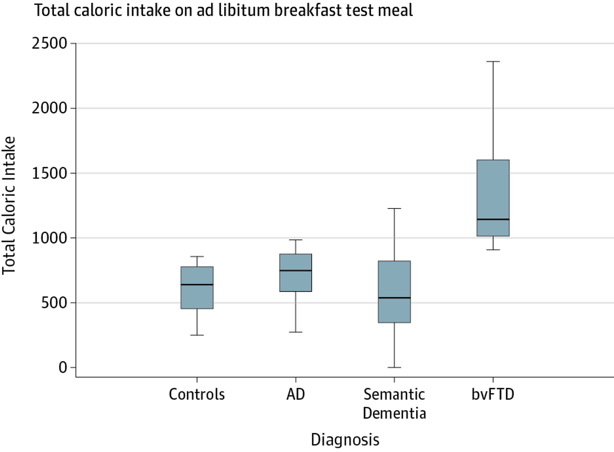

Click on the following link to clone the assignment repository into your own private repository, and then create an RStudio Cloud project in the class workspace named "HW-01" using this private repo: 

[https://classroom.github.com/a/BiLy9VxR](https://classroom.github.com/a/BiLy9VxR)

**Note**: Part of your grade on this assignment will be based on the commit history/comments in your assignment repository (more details in Exercise 1). You must turn in a knitted .pdf file to Gradescope from a markdown file based on the template in your cloned repository by 11:59p US Eastern on May 26th in order to receive credit. Be sure to "associate" questions appropriately on Gradescope. As a reminder, late work is not accepted.

1. **6 points** Make sure your GitHub repository for this assignment has at least three commits, each with a meaningful commit message.

Ahmed et al. (*JAMA Neurology*, 2016) conducted a study examining disturbances in eating behaviors among patients with dementia. Patients without dementia, with Alzheimer disease (AD), with semantic dementia, and with behavioral-variant frontal temporal dementia (bvFTD) were offered a breakfast buffet and left alone for 30 minutes to eat. After completion, the total caloric intake of each patient was measured. Boxplots summarizing the distributions of calories consumed across the patient types are displayed below.

```{r boxplots, fig.margin = TRUE, echo = FALSE, out.width = "100%", out.extra='style="background-color: #00539B; padding:2px; display: inline-block;"'}

```

2. **3 points** Was this an observational study or an experimental study, and why? Why do you think the authors conducted this type of study?
3. **2 points** What is the main advantage of randomized, controlled, experimental studies compared to observational studies? 
4. **3 points** Do you expect the distribution of caloric intake among bvFTD patients to be left-skewed, right-skewed, or symmetric? Why?
5. **5 points** What type of data are the following variables in the study? Be specific, e.g., "categorical ordinal" or "numeric continuous."
- Type of dementia (AD/SD/bvFTD/None)
- Total caloric intake 
- % of calories from sugar 
- Disease duration
- Frontal Rating Scale (mild/moderate/severe)
6. **2 points** Describe an appropriate visualization examining the Frontal Rating Scale among these participants.
7. **2 points** Describe an appropriate visualization comparing total caloric intake at the breakfast buffet to the disease duration in years among these study participants.
8. **2 points** How might you modify your answer in Exercise 7 in order to additionally incorporate the Frontal Rating Scale of the participant?
9. **2 points** How might you modify your answer in Exercise 7 in order to additionally incorporate the % total calories from sugar of the participant?
10. **3 points** The authors state that they uncovered *"elevated total caloric intake...in patients with bvFTD, supporting its diagnostic value for this disease...."* Do you think this is a reasonable statement to make from the data visualization? Why or why not?
11. **2 points** Suppose the authors wanted to "tell a story" with the title to their visualization. Suggest a more effective title than the one presented.

Wang et al. (*The Lancet*, 2020) conducted a multicenter randomized trial of remdesivir in adults with severe COVID-19, finding that receipt of remdesivir was not associated with statistically significant clinical benefits. Some characteristics of their study population are as follows:

```{r covid1, fig.margin = TRUE, echo = FALSE, out.width = "100%", out.extra='style="background-color: #00539B; padding:2px; display: inline-block;"'}
knitr::include_graphics("img/covid1.png")
```

Calculate the following probabilities (you shouldn't need a calculator, but remember that R can serve as one; it's ok to express answers as unsimplified fractions). If the probabilities cannot be determined, please state why and what additional information is needed to calculate the quantity of interest.

What is the probability that a randomly selected patient in the trial ...

12. **2 points** ...was assigned to placebo?
13. **2 points** ...was male?
14. **2 points** ...was assigned to placebo or was male?
15. **2 points** ...was assigned to placebo and was male?
16. **2 points** ...had diabetes or was not assigned to placebo?
17. **2 points** ...was male or had diabetes?
18. **2 points** ...was assigned to remdesivir and did not have fever?
19. **2 points** ...had fever or respiratory rate >24 breaths/minute?
20. **2 points** ...had no comorbidities and was not assigned to placebo?