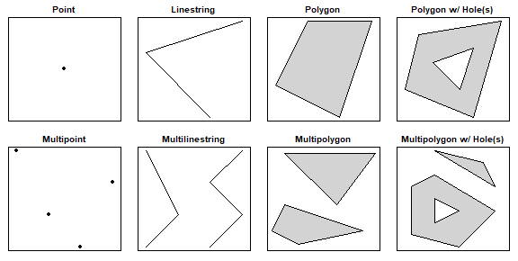

<br>

Today's lab will explore what to do when you have a merge conflict with others, which may have seen already through the course of your collaboration last week in Lab 04. Additionally, you will work with your *team* to create a spatial visualization using *simple features* and map data. 

**Do not configure Git until the team-based section.**

# Visualizing spatial data

**On your own**: Follow along with the code and results presented in the following section. This portion will not be graded; it is only for you to familiarize yourself with the basics of spatial data visualization (no need to select a specific GitHub repository to create an RStudio Cloud project from).

## Packages

Run the following code to load the needed packages. You may need to `install.packages()` them first; note that they're both pretty big, so if you need to install them, it may take a bit:

```{r, warning = F, message = F}
library(tidyverse)
library(sf)
```

We will use the `sf` package, which stands for **simple features**. Simple features are a commonly-used spatial data standard that specify storage and access for map geometrics used by geographic information systems (GIS). The `sf` package in `R` represents simple features in a tidy way, in which each row standards for a simple feature, and each column corresponds to a variable.

Simple features use 2D geometries which "connect the dots" between defined points in space:

```{r, out.width = "350%", eval=TRUE, echo=FALSE}
library(knitr)

```

## Reading in data

To read simple features from a file or database, use the `st_read()` function. There are already some objects included in the `sf` package. We will load a file that corresponds to the counties in North Carolina:

```{r}
library(sf)
nc <- st_read(system.file("shape/nc.shp", package = "sf"), quiet = TRUE)
nc
```

When calling the `nc` object, you should see some metadata associated with these data:

- geometry type: this specifies what geometry is used to plot the simple feature (here, a MULTIPOLYGON)
- dimension: this specifies the spatial dimensions used in plotting (here, the X and Y plane)
- bbox: a bounding box: the bounds corresponding to each dimension (here, the latitudes and longitudes on the X-Y plane)
- epsg (SRID): a unique spatial reference identifier associated with a specific coordinate system; [more info here](https://spatialreference.org/ref/epsg/nad27/) (don't worry about it too much)
- proj4string: another way of defining a coordinate system (don't worry about it too much)

Other than these metadata, we have a tidy dataset as we're used to, except the last column is a geometry. 

## SIDS

The dataset from today examines Sudden Infant Death Syndrome (SIDS) in each county in North Carolina. SIDS is an unexplained death of an apparently healthy infant, often occurring during sleep. We will create a basic visualization that maps the number of SIDS cases to each county. A few of the variables in the dataset are as follows:

- NAME: The county name
- FIPS/FIPSNO: The FIPS code of the county (a five digit Federal Information Processing Standards code that uniquely identifies US counties)
- BIR74: The number of births in 1974
- SID74: The number of SIDS cases in 1974
- NWBIR74: The number of non-white births in 1974
- BIR79, SID79, NWBIR79: similarly for 1979

## Creating plots

Now let's create a basic plot using the `nc` object! `sf` objects work well with the tidyverse. For instance, try the following code, noting that we did not specify any aesthetic mapping:

```{r}
ggplot(data = nc) + 
  geom_sf()
```

We can also add some global plot options:

```{r}
ggplot(data = nc) +
  geom_sf(color = "purple", fill = "lightblue") +
  theme_bw()
```

Remember that in our dataset, we had some data that corresponded to each county. How might we incorporate them into our plot? We need to set an aesthetic mapping. **Importantly**: for `sf` geometries, the aesthetic mapping is done in the `geom_sf()` layer. 

Let's create a **choropleth map** that displays the number of births in 1974 for each county. Note how the following code is different from the earlier code:

```{r}
ggplot(data = nc) +
  geom_sf(aes(fill = BIR74)) +
  theme_bw()
```

We can also manually set the color scheme by adding a `scale_fill_gradient()` layer. Here, we'll specify hex values for our color extremes:

```{r}
ggplot(nc) +
  geom_sf(aes(fill = BIR74)) +
  scale_fill_gradient(low = "#fee8c8", high ="#7f0000") +
  theme_bw()
```

## dplyr() with simple features

As said previously, simple features work well with the tidyverse. For instance, we can use `dplyr()` functions to manipulate data. Let's filter for observations with over 10,000 births in 1979, and select only the county name and number of birth variables:

```{r}
nc %>% 
  filter(BIR74 > 10000) %>% 
  select(NAME, BIR74)
```

Notice that the geometry is **"sticky"**: the geoemtry and metadata associated with it are still carried with the dataset, even though we didn't select for it. In order to remove the geometry, include the function `st_drop_geometry()` in your pipeline:

```{r}
nc %>% 
  filter(BIR74 > 10000) %>% 
  select(NAME, BIR74) %>% 
  st_drop_geometry()
```

# Merge conflicts (uh oh)

When two collaborators make changes to a file and push the file to their repository at the same time (i.e., without pulling), git merges these two files as illustrated below:

```{r, eval=TRUE, echo=FALSE}
include_graphics("img/merge-no-conflict.png")
```

If these two files have conflicting content on the same line, git will produce a **merge conflict**. Merge conflicts nede to be resolved manually, as they require human intervention:

```{r, eval=TRUE, echo=FALSE}
include_graphics("img/merge-conflict.png")
```

To resolve the merge conflict, decide if you want to keep only your text, the text on GitHub, or incorporate changes from both texts. Delete the conflict markers `<<<<<<<`, `=======`, `>>>>>>>` and make the changes you want in the final merge:

```{r, eval=TRUE, echo=FALSE}
include_graphics("img/merge-conflict-identifiers.png")
```

# Resolving a merge conflict 

Team repositories have already been created for you with the prefix `lab-05-`. This assignment is due **June 30** at 11:59p. 

[Your team repository may be found here.](https://github.com/sta198-su20)

**Assign numbers 1, 2, 3, and 4 to each of your team members** (if only 3 team members, just number 1 through 3). Carefully go through the following exercises as a group **in order**, which simulate a merge conflict. **Correctly completing this exercise will be worth 15 points on this week's lab grade.**

1. **0 points. Everyone**: A lab repo has been created for you on GitHub. Clone this repo in RStudio Cloud and open the R 
Markdown file. Don't forget to configure git:

2. **3 points. Member 1**: Change the team name to your team name. *Knit, stage, commit, and push*.

3. **3 points. Member 2**: Do not pull the changes from Member 1. However, change the team name to something different (i.e., not your
team name). *Knit, stage, commit, and push*. 

**You should have gotten an error.**

**Member 2 only: pull the repository** and review the document with the merge conflict. A merge conflict occurred because you edited the same part of the document as Member 1. Resolve the conflict by choosing to keep your real team name, then knit, stage, commit and push again. **Discuss the error with your teammates.**

4. **3 points. Member 3**: Do not pull the changes from Members 1 or 2. Write some narrative in the space provided for Exercise 6 (it doesn't matter what you write, just write something!), then knit, commit, and push. 

**You also should have gotten an error.** A merge conflict should have occurred with the header of the document, since now it no longer matches the commit you made to the team name. However, this time, no merge conflicts should occur *with Exercise 6*, since this is a different part of the document from Members 1 and 2. **Discuss the error with your teammates.**

**Member 3 only: pull the repository**, and finally, knit, commit, and push your changes.

5. **0 points. Everyone**: Pull the latest repository. Now you should all be synced up. 

6. **6 points. Member 4** (if no member 4, then choose another group member to complete this): describe the two errors your team encountered in exercises 3 and 4. What were the similarities between these two errors? What made the error from exercise 3 different from that of exercise 4 in terms of what you might have expected?

# More maps!

We will be using the `nc` dataset again, as loaded from the `sf()` package. In your team repository, read in the dataset as you did on the guided individual portion. 

**Every member** must make at least one meaningful commit to Exercises 7 - 10; failure to do so may result in up to 5 points taken off the assignment.

7. **5 points** Create a map that plots the number of SIDS cases by NC county in 1979. Why is this a misleading plot?
8. **7 points** Now create a map that plots the SIDS *rate* by NC county in 1979 (the number of cases / population).
9. **8 points** Finally, create a map that plots the difference in SIDS rate by NC county from 1974 to 1979. Create a table that lists the top five "most-improved" counties based on the difference in SIDS rate from 1974 to 1979, being sure to drop the associated geometry from your table.
10. **15 points** If you were a health data scientist working for the state of NC in 1980, which counties would you focus on regarding SIDS (knowing that public health funds are very limited!)? Explain, using any graphs or tables as needed.
