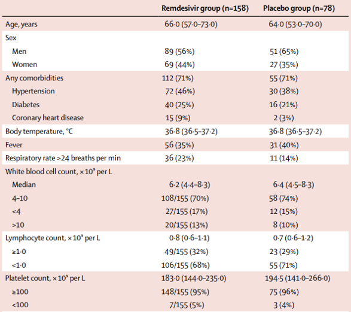

<br>

Today's lab will introduce you to best practices when coding. As part of the lab, we will learn about the basics of writing reusable functions in R.

This is an individual lab; the repository may be cloned at the following link:

[https://classroom.github.com/a/28sMkYRx](https://classroom.github.com/a/28sMkYRx)

Don't forget to configure Git. This week's lab will again use the CDC data from the first lab that displays health indicators for each of the 50 states. Load the tidyverse and data into your environment before proceeding. 

1. **0 points** Set messages and warnings to be FALSE in your R chunk options, and make sure your repository has at least 3 commits, each with a meaningful commit message. Up to 5 points may be taken off for not following these repository guidelines. 

In Exercises 2 - 5, we will be using the `tidyverse` library and the `cdc` dataset located in the `data` folder.

```{r, message = F, warning = F}
library(tidyverse)
cdc <- read_csv("data/cdc.csv")
```

# Why write functions?

You've already seen some functions in R such as those in `ggplot2` and `dplyr` as well as statistical functions such as `mean`, `t.test`, etc. 

Suppose we're interested in creating scatterplots of obesity % in a state vs. adult smoking % in a state. Before you start, do you see any potential issues in the code below?

```{r, eval = F}
cdc %>% 
  filter(hdi == "Bottom ten") %>% 
  ggplot(data = ., mapping = aes(x = obesity, y = smoking)) +
    geom_point() +
    labs(x = "Obesity %",
         y = "Smoking %", 
         title = "Obesity vs. Smoking, Bottom ten HDI")

cdc %>% 
  filter(hdi == "Middle") %>% 
  ggplot(data = ., mapping = aes(x = obesity, y = smoking)) +
    geom_point() +
    labs(x = "Obesity %",
         y = "Smoking %", 
         title = "Obesity vs. Smoking, Middle HDI")

cdc %>% 
  filter(hdi == "Top ten") %>% 
  ggplot(data = ., mapping = aes(x = obesity, y = smoking)) +
    geom_point() +
    labs(x = "Obesity %",
         y = "Smoking %", 
         title = "Obesity vs. Smoking, Middle HDI")
```

Whenever you've copied and pasted a block of code more than twice, think about using a function instead. **Functions** are used to automate common tasks in a powerful and generalizable way. By using functions, as code requirements change, you only need to update code in one place (in the function call) instead of many, and you also eliminate the chance of making incidental mistakes when you copy and paste (e.g., updating a variable name in one place, but not in another, as was done in the example above with the plot label not always matching the data!). 

Looking forward, you can improve your reach as a data scientist by writing functions and entire packages for other people to use -- an example of this was the `genius` package written by Josiah Parry that we saw two weeks ago.

# Function components

Functions in R have just four components: the function's name, the input values, the code to be executed, and the output. Let's explore a basic function:

```{r}
calc_bmi <- function(mass_lb, ht_in){
  bmi <- 703 * mass_lb/ht_in^2
  return(bmi)
}
```

This function is named `calc_bmi` and has two inputs: `mass_lb` and `ht_in`, which correspond to mass in pounds and height in inches. The function calculates BMI based on the formula given in the function. Although this function calculates `bmi`, it doesn't do anything with it. To tell an R function to output an new dataset or variable created during the function code, use the `return` function so R knows what the output of your function should be.

Let's try running the function we wrote above with the average weight and height for a US male, which are 198 pounds and 69 inches:

```{r}
calc_bmi(mass_lb = 198, ht_in = 69)
```

We see that the calculated BMI is 29.4.

Note that we chose the name for the function as well as the names for the input and output arguments. However, the function must use the inputs and outputs provided. It is a good idea to choose meaningful names that are preferrably short and clearly evoke what the function does or what the inputs/outputs are. Additionally, avoid overwriting existing functions, especially if they are widely used (e.g. don't name a function `summarize`). 

As an example, the following code would also work to calculate BMI (assuming `qwer` is mass in pounds and `zxcv` is height in inches), but would be much less clear to readers:

```{r}
asdf <- function(qwer, zxcv){
  house <- 703 * qwer/zxcv^2
  return(house)
}

asdf(qwer = 198, zxcv = 69)
```

Here is another example, which takes as input the temperature in Fahrenheit, and returns the temperature in Celsius and Kelvin, rounded to 1 decimal place.

```{r}
temp_convert <- function(temp_f){
  temp_c <- round((temp_f - 32) * 5/9, 1)
  temp_k <- round(temp_c + 273.15, 1)
  
  return(c(temp_c, temp_k))
}

temp_convert(75)
```

# Back to the CDC data...

What was wrong with the code given earlier? Not only was it too repetitive in doing the same essentially similar task over and over, but we also made a mistake in the plot title! Examine the following function written to create the scatterplot of obesity % vs. the adult smoking %, and answer the questions that follow. 

```{r, eval = F}
cdc_plot <- function(hdi_value, plot_title){
  filtered_data <- cdc %>% 
    filter(hdi == hdi_value)
    
  out_plot <- ggplot(data = filtered_data, 
                     mapping = aes(x = obesity, y = smoking)) +
      geom_point() +
      labs(x = "Obesity %",
           y = "Smoking %", 
           title = plot_title)
  return(out_plot)
}

cdc_plot(hdi_value = "Bottom ten", 
         plot_title = "Obesity vs. Smoking, Bottom ten HDI")
```

1. **3 points** What is the name of the function, the input(s), and the output(s)?
2. **4 points** What do the input(s) and output(s) correspond to?
3. **3 points** Explain why the following code would not work:
```{r, eval = F}
cdc_plot(hdi_value = Bottom ten, 
         plot_title = Obesity vs. smoking, Bottom ten)
```
4. **5 points** Use the `cdc_plot` function provided to create three accurate plots of obesity vs. smoking % by HDI status.

```{r, echo = F, eval = F}
prop <- function(x1, x2, n1, n2, alpha){
  p_pool <- (x1 + x2)/(n1 + n2)
  z <- (x1/n1 - x2/n2)/sqrt(p_pool * (1 - p_pool) * (1/n1 + 1/n2))
  z_use <- -abs(z)
  p_val <- 2*pnorm(z_use, mean = 0, sd = 1)
  return(p_val)
}
```


# Your turn!

Remembering all the way back to HW 01, Wang et al. (*The Lancet*, 2020) conducted a multicenter randomized trial of remdesivir in adults with severe COVID-19. Some baseline characteristics of their study population are displayed in the table below. 

```{r covid1, fig.margin = TRUE, echo = FALSE, out.width = "100%", out.extra='style="background-color: #00539B; padding:2px; display: inline-block;"'}

```

As a reminder from Lecture 13, to compare two proportions, the test statistic given by
\begin{align*}
Z = \frac{(\hat{p}_1 - \hat{p}_2) - (p_1 - p_2)}{\sqrt{\hat{p}_{pool}(1 - \hat{p}_{pool})\left(\frac{1}{n_1} + \frac{1}{n_2} \right)}}
\end{align*}

has a standard normal distribution under certain assumptions (refer to the slides for details).

Suppose you are interested in whether there was a difference between the proportion of patients in the remdesivir group and the placebo group in presence of hypertension, diabetes, coronary heart disease, fever, or fast respiratory rate (>24 breaths/min) at baseline. 

6. **20 points** Write a function that will perform this hypothesis test, returning the p-value. <br><br>
**Hint:** Think about what inputs and outputs you need for your function. Be especially careful when calculating the p-value from your Z score with respect to what sign the Z statistic is and which tail you are calculating probabilities from. You may find the `abs()` function helpful, which calculates the absolute value of whatever is inside the parentheses. Multiplying this by -1 will ensure that you get a negative value.
7. **5 points** Which condition(s) demonstrate(s) a statistically significant difference in proportions at the $\alpha = 0.05$ level? Be careful about multiple testing. **Note**: if you cannot get your function in Exercise 6 to work, you may use built-in R functions to answer this question. These will be introduced in HW 06.
8. **10 points** Choose one baseline comorbidity of interest. Formally write-up the results from your hypothesis test, including the null and alternative hypotheses, the distribution of the test statistic under the null, the value of the test statistic, your p-value and conclusion, and results in context of the original research question.